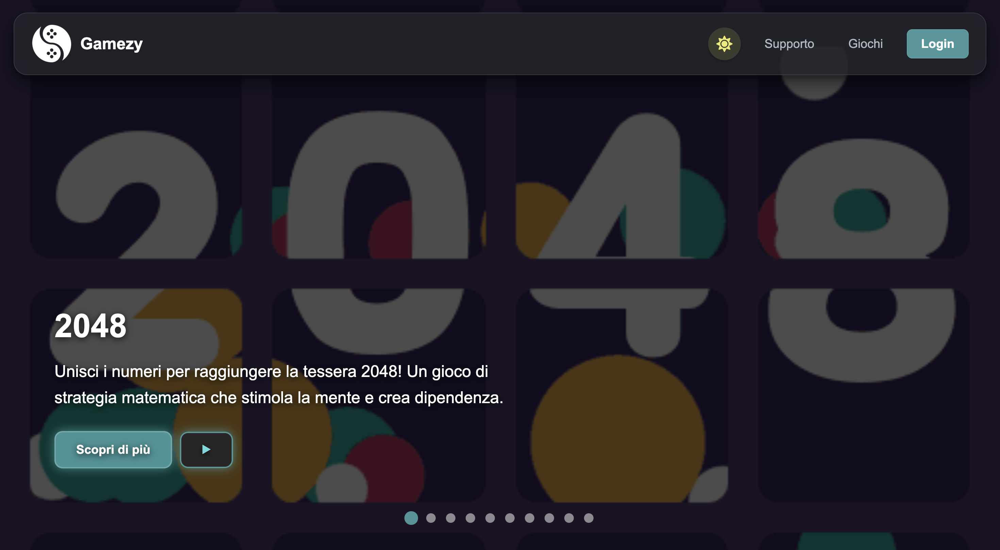

# 🎮 Gamezy

> **A gaming website created as a school project**



**Gamezy** is a gaming-focused website developed as a school project.
The goal of the project is to create an interactive and visually engaging platform dedicated to videogames, combining a modern interface with different sections and interactive elements.

## 🌐 Live Website

**[Visit Gamezy](https://lore1677.github.io/Gamezy/)**

> The website is hosted for free using **GitHub Pages**.

## ✨ Features

### 🎮 Gaming Hub

Gamezy is centered around videogames and provides a dedicated environment where users can explore the different content available on the website.

The project includes a dedicated **Games** section, with individual pages and resources related to the videogames presented on the platform.

### 👤 Account Section

The website includes an **Account** area designed to represent the user side of the platform.

This section is part of the project's attempt to reproduce the structure of a real gaming website, with dedicated pages and navigation.

### 🕹️ Interactive Interface

Gamezy includes several interactive elements designed to make the website more engaging:

* Interactive navigation
* Animated elements
* Dedicated game pages
* Custom graphics and icons
* Audio effects
* Splash screen animation

When the website is opened, users are presented with an interactive splash screen. By clicking the diamond, an audio effect is played and the user is redirected to the main homepage.

### 🔊 Audio

The project also includes custom sound resources.

For example, the initial splash screen uses a coin sound effect when the user interacts with the diamond.

### 🖼️ Graphics & Assets

The repository contains a dedicated collection of visual and multimedia resources used throughout the website, including:

* Game images
* Icons
* Animated images
* Backgrounds
* Audio files
* Other interface assets

These resources are organized into dedicated folders to keep the project structure clean and easy to maintain.

## 📁 Project Structure

```text
Gamezy/
│
├── account/        # Account-related pages
├── games/          # Game-related pages
├── images/         # Images, icons and other visual assets
├── sounds/         # Audio resources
├── support/        # Support-related pages
│
├── index/
│   └── ...         # Main website pages and styles
│
├── index.html      # Website entry point
├── splashscreen.css # Splash screen styling
├── favicon.ico     # Website favicon
├── structure.bash  # Project structure utility
├── TODO.todo       # Project TODO list
└── README.md       # Project documentation
```

## 🛠️ Technologies

The website is built using web technologies including:

* **HTML5** for the structure of the website
* **CSS3** for styling, layouts and animations
* **JavaScript** for interactive functionality
* **Git & GitHub** for version control and project management

## 🚀 Running Locally

To run Gamezy locally, clone the repository:

```bash
git clone https://github.com/Lore1677/Gamezy.git
```

Then enter the project directory:

```bash
cd Gamezy
```

Open the project using your preferred code editor or launch `index.html` in a browser.

For development, using a local server is recommended.

## ☁️ Deployment

Gamezy can be deployed using **GitHub Pages**, GitHub's free static website hosting service.

GitHub Pages can publish HTML, CSS and JavaScript files directly from a repository, making it suitable for this project.

### GitHub Pages

**[🔗 GitHub Pages](https://pages.github.com/)**

The deployed website will be available at:

**https://lore1677.github.io/Gamezy/**

## 📌 Project Status

🟢 **Active development**

Gamezy was originally created as a school project and can continue to be improved with new games, features, visual improvements and interactive functionality.

## 👨‍💻 Author

**Lore1677**

GitHub:
**[github.com/Lore1677](https://github.com/Lore1677)**

---

⭐ If you like the project, feel free to check out the repository!

**[View the source code on GitHub →](https://github.com/Lore1677/Gamezy)**
